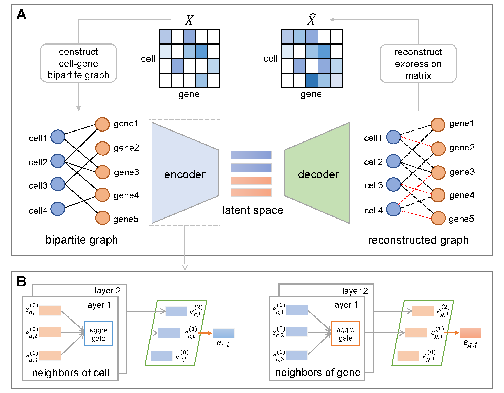

# scBiG for representation learning of single-cell gene expression data based on bipartite graph embedding

## Overview



scBiG is a graph autoencoder network where the encoder based on multi-layer graph convolutional networks extracts high-order representations of cells and genes from the cell-gene bipartite graph, and the decoder based on the ZINB model uses these representations to reconstruct the gene expression matrix. By virtue of a model-driven self-supervised training paradigm, scBiG can effectively learn low-dimensional representations of both cells and genes, amenable to diverse downstream analytical tasks.

## Installation

Please install `scBiG` from pypi with:

```bash
pip install scbig
```

Or clone this repository and use

```bash
pip install -e .
```

in the root of this repository.

## Quick start

Load the data to be analyzed:

```python
import scanpy as sc

adata = sc.AnnData(data)
```


Perform data pre-processing:

```python
# Basic filtering
sc.pp.filter_genes(adata, min_cells=3)
sc.pp.filter_cells(adata, min_genes=200)

adata.raw = adata.copy()

# Total-count normlize, logarithmize the data, calculate the gene size factor 
sc.pp.normalize_per_cell(adata)
adata.obs['cs_factor'] = adata.obs.n_counts / np.median(adata.obs.n_counts)
sc.pp.log1p(adata)
adata.var['gs_factor'] = np.max(adata.X, axis=0, keepdims=True).reshape(-1)
```

Run the scBiG method:

```python
from scbig import run_scbig
adata = run_scbig(adata)
```

The output adata contains the cell embeddings in `adata.obsm['feat']` and the gene embeddings in `adata.obsm['feat']`. The embeddings can be used as input of other downstream analyses.

Please refer to `tutorial.ipynb` for a detailed description of scBiG's usage.